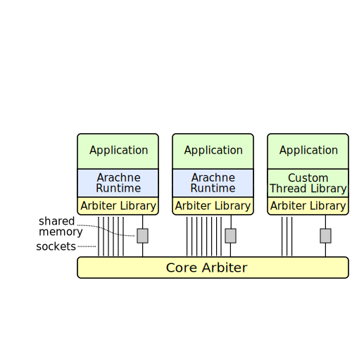

# Arachne
## Core-Aware Thread Management
#### Henry Qin Thesis Proposal

#HSLIDE

### Outline
 - Problem Description & Background
 - Hypothesis
 - Current Status
 - Initial Results
 - Additional Work
 - Related Work
 - Request for Feedback

#HSLIDE

## The Problem

Hard to simultaneously achieve
 - Low latency
 - High throughput
 - Efficient core utilization

#HSLIDE

##  RAMCloud
<!-- #### Low latency by polling wastes cores -->
 - Polling for responses to RPC's wastes cores
 - High cost of context switches

<!-- TODO: Insert the diagram from poster long long ago   -->

#HSLIDE

## Redis
 - Single core event loop

 - One core ==> high throughput and low latency
 - Multiple cores ==> bad core utilization

#HSLIDE

## Nginx
<!-- #### Low latency and high throughput with multiple non-blocking event loops on multiple processes. -->
 - *Statically* configurable number of processes
 - Normal Configuration: Fixed number of processes equal to the number of cores
<!-- TODO: Insert architecture diagram for Nginx, and voiceover why this is bad for utilization  -->

#HSLIDE

## Limitations on existing solutions
 - Kernel scheduling
    - Multi-us scheduling operations
    - Lack of application state awareness
 - M:N User Threads over Kernel Threads
    - Kernel multiplexing of underlying kernel threads
    - Blocking IO
 - Event loop in kernel threads
    - Programming model complexity: Manual stack ripping
    - Scalability often limited to a single core
    - Kernel multiplexing of underlying kernel threads

#HSLIDE

## Hypothesis
### We can achieve high throughput, low latency, and efficient core utilization by allocating cores system-wide and scheduling in each application.

<!-- #HSLIDE -->
<!--  -->
<!-- ## Thread scheduling is not a solved problem. -->
<!--  -->
<!-- The Linux Scheduler: a Decade of Wasted Cores -->
<!--  - Cores stay idle for seconds while ready threads wait to run. -->

#HSLIDE

## Current Progress
 - Thread runtime implemented as a C++ library
    - Cache Conscious Design ==> thread creations in ~200 ns (6 cache operations)
    - Core estimation ==> Control latencies and resource utilization under changing loads
 - Core arbiter implemented as a setuid process
    - Priority-based core allocation among applications

#HSLIDE

<!-- TODO: Add slides describing Arachne and the Core Arbiter. -->

## Arachne Architecture

#HSLIDE
## Initial Results
#### RAMCloud machines (Nahalem Lynnfield, Xeon X3470 @ 2.93 Ghz, 4-Core with Hyperthreading Disabled)
 - 60 ns yield
 - 160 ns cross-core thread creation
 - 180 ns cross-core condition variable wakeup

#HSLIDE
## Initial Results

#### CloudLab c220g1 (2 Haswell, Intel E5-2630 v3 @ 2.40 GHz, 8-core CPUs)
 - 120 ns yield
 - 470 ns cross-core thread creation
 - 355 ns cross-core condition variable wakeup

#HSLIDE

## Additional Research Before Thesis
 - Can we efficiently handle blocking system calls using our dual user/kernel
   approach?
 - Can we devise policies for effectively relating parallelism with detected
   application load?
 - Can we efficiently mediate between multiple applications with changing
   workloads?

#HSLIDE

## Related Work
 - Scheduler Activations
 - Capriccio
 - Linux Cgroups
 - Golang

#HSLIDE

## 25 Years Ago: Scheduler Activations
 - A hybrid threading model in which the kernel and userspace threading library
   share information about application requirements and kernel events.
 - The kernel migrates "activations" and preempts cores, and then tells the
   application afterwards using an upcall.

#HSLIDE

## 14 Years Ago: Capriccio

 - A user-level N:1 threading package from Berkeley which feature the same
   performance as events-based models, by using static analysis to make
   resource utilization more efficient.
 - Handle blocking IO's by changing all IO's into nonblocking IO's.

#HSLIDE

## 9 Years Ago: Linux Cgroups

 - Linux kernel feature for resource (compute, memory, IO) isolation of one or
   more processes.
 - Could we leverage this for core allocation?

#HSLIDE

## Linux Cgroups for core allocation

 - We can and will use this for initial testing, but is not a permanent solution.
   - Does not solve the blocking IO problem
   - Does not allow us to move in-kernel threads off of our cores.

#HSLIDE

## 4 Years Ago: Golang Goroutines

 - Partially preemptive threading package embedded in language runtime
 - Extremely lightweight threads with initially small, growable stacks
 - Transparently spins up more kernel threads when current user threads block
   on system calls

#HSLIDE

## Conclusion
    - github.com/PlatformLab/Arachne

#HSLIDE

## Request for Feedback
